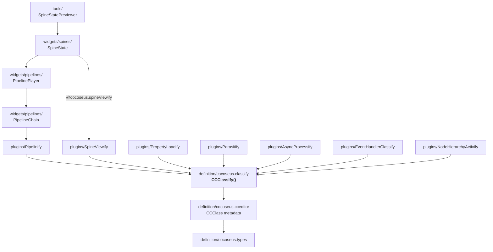

# Cocoseus 1.0.0
**Cocoseus is a Cocos Creator editor extension.**
It is not a game framework, but **a meta programming library** for Cocos Creator 3.8. Its main goal is to attach behaviors to a Component class without requiring rigid inheritance chains, while retaining full visibility and property serialization within the Editor's Inspector.

## 2. System Map

```
assets/scripts/
├── definition/          ← CORE LAYER: metaprogramming, decoupled from gameplay
│   ├── cocoseus.ts                  public facade
│   ├── cocoseus.types.ts            all types/interfaces/constants
│   ├── cocoseus.classify.ts         mixin injector ENGINE — CCClassify()
│   ├── cocoseus.cceditor.ts         CCClass metadata hooks + Editor API bridge
│   └── cocoseus.utils.ts            pure utilities (string/ui/function/graph)
├── plugins/             ← MIXIN LAYER: each file = 1 composable capability
│   ├── Parasitify.ts                overrides methods of other Components on the same node (Cocos Creator's Node Tree)
│   ├── AsyncProcessify.ts           token-based asynchronous wait gate
│   ├── EventHandlerClassify.ts      event registration via @onEvent decorator
│   ├── Pipelinify.ts                sync/async pipeline on AssetManager.Task
│   ├── PropertyLoadify.ts           Asset property → lazy loaded from bundle at runtime
│   ├── NodeHierarchyActivify.ts     3 mixins for node tree manipulation
│   └── SpineViewify.ts              sp.Skeleton control + dynamic enum for Inspector
├── widgets/             ← COMPONENT LAYER: concrete classes, usable in scenes
│   ├── pipelines/  PipelineType     · PipelineChain (182) · PipelinePlayer (178)
│   └── spines/     SpineType        · SpineState (433)
└── tools/               ← EDITOR TOOL LAYER: runs exclusively in Editor
    └── spine/SpineStatePreviewer.ts . Use https://github.com/hallopatidu/spine_scene_previewer instead
```


## The Problem to Solve
In Cocos Creator, a Component is registered via @ccclass. The engine stores property metadata in a static cache on the constructor under the key '__ccclassCache__'. If you create an intermediate class using a standard mixin:
``` TypeScript
class MyComp extends SomeMixin(Component) { ... }
```
the @property declarations inside the mixin will reside in the intermediate class's cache, preventing the Inspector from seeing them on the final class. 
**CCClassify** was built specifically to patch this issue.
